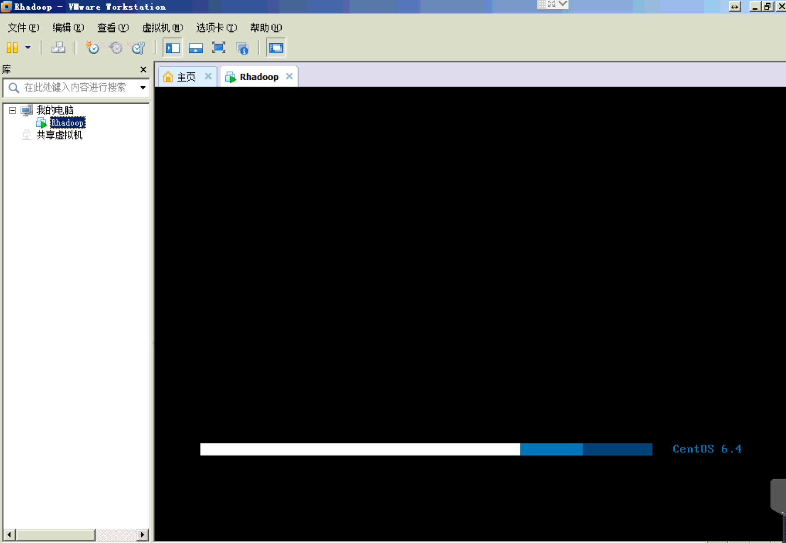
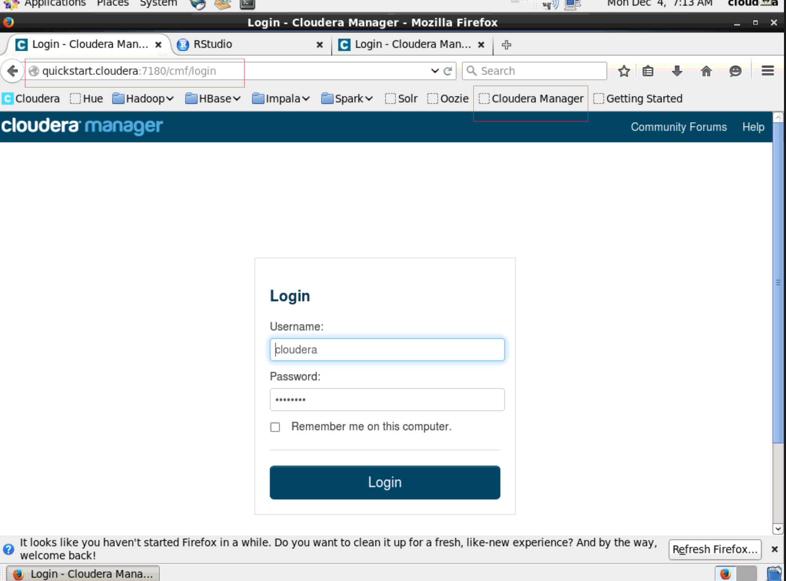
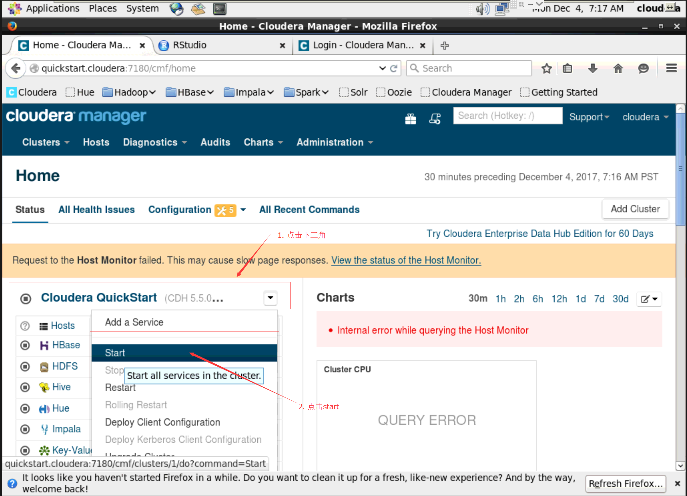
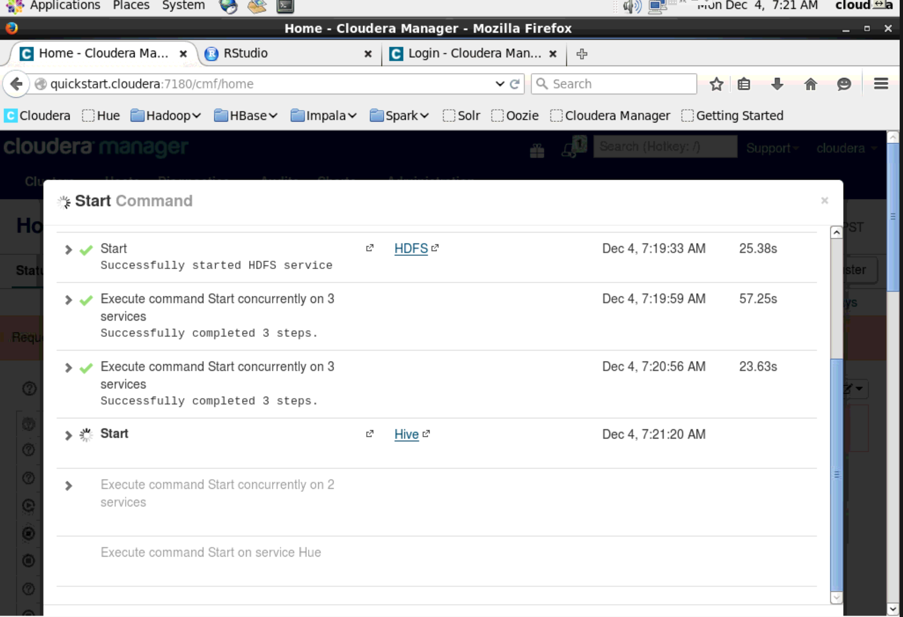
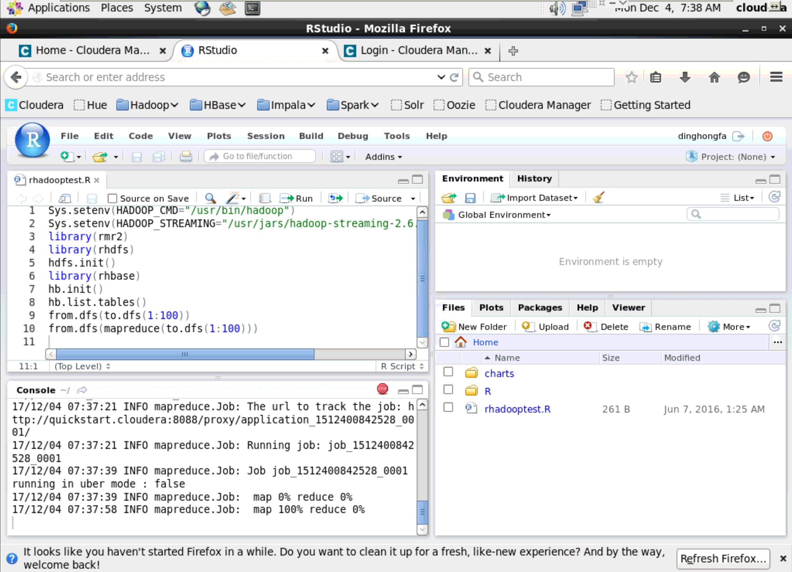
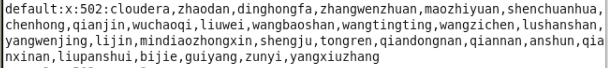

# 贵州财经大学经济仿真重点实验室Rhadoop服务器管理员操作指南

> 信息学院 丁红发  2017-12-4

为了使服务器管理具备延续性，便捷性，撰写此指南。

**注意本指南的操作只能在校内网络进行，指南内容保密于实验室内部。**

## 一、 进入物理服务器，启动RHadoop虚拟服务器

物理服务器放置于重点实验室内部，用户名和密码请毛志远补充保管，并延续下去。

1. 应用服务器用户名和密码登陆物理服务器

   > 过程略

2. 打开VMware Workstation，并启动Rhadoop虚拟机

   

   用户名和密码都是cloudera

   ## 二、 启动Rhadoop服务

   1. 登陆web端Hadoop管理器

      

      注意网址:  http://quickstart.cloudera:7180/cmf/login，已经收藏在收藏夹下，用户名和密码都是cloudera

   2. 启动服务

      

      如上图，在登陆后的首页，启动服务，会看到如下启动过程界面。

      

      启动后，可根据管理需要，重新启动、关闭等。管理员熟悉以后，可以对其中的子模块进行关闭、调试等，提高服务器性能。

      ## 三、 测试Rhadoop服务

      1. 应用Rstudio web端测试服务

      浏览器打开：http://10.19.5.60:8787/ 用户名密码都是dinghongfa

      默认已经打开测试代码，见下图。

      

      逐行执行代码，能够得到结果，说明正确。

      

      ## 四、添加或删除Rhadoop用户

      当前系统中已经有的用户都可以在校园网中在地址：http://10.19.5.60:8787/ 进行登陆，并编程。

      目前已有用户如下：

      

      管理员可以应用Linux命令useradd 创建用户。

      祝好！